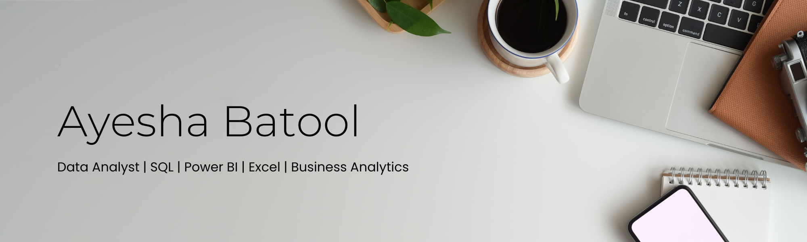

# Welcome to Ayesha's Portfolio 👋

I'm a Data Analyst focused on solving business problems through data from understanding the problem and exploring the data to identifying key drivers and communicating actionable insights.

- Breaking down business problems into analytical questions and identifying key performance drivers.
- Exploring trends, patterns, anomalies, and relationships to uncover meaningful insights.
- Cleaning and transforming raw data into accurate, analysis-ready datasets.
- Using SQL to analyze data, answer business questions, and test hypotheses.
- Building data models, DAX measures, and interactive Power BI dashboards to support decision-making.

### 📂 Projects

Here are my [Projects](https://github.com/Ayeshah123?tab=repositories).

### 🤝 Let's Connect

- Connect with me on [LinkedIn](https://www.linkedin.com/in/ayesha-analyst/)
- [Email me](ayeshabatool160@gmail.com)
